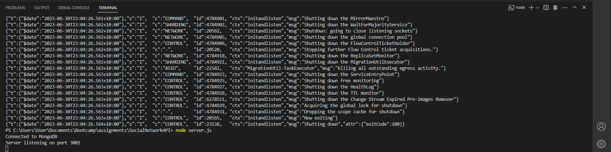
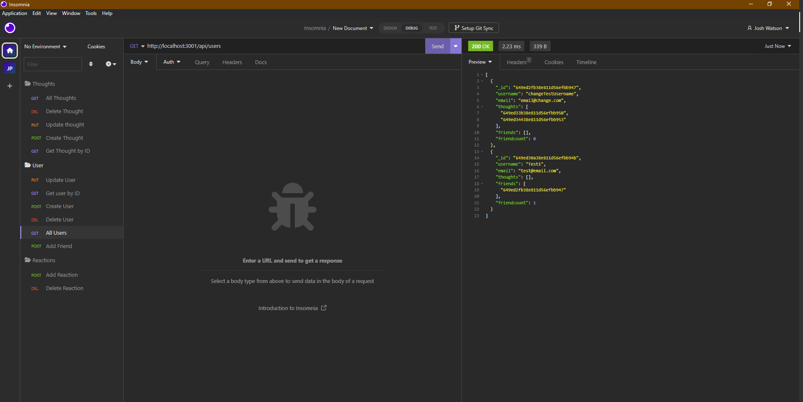
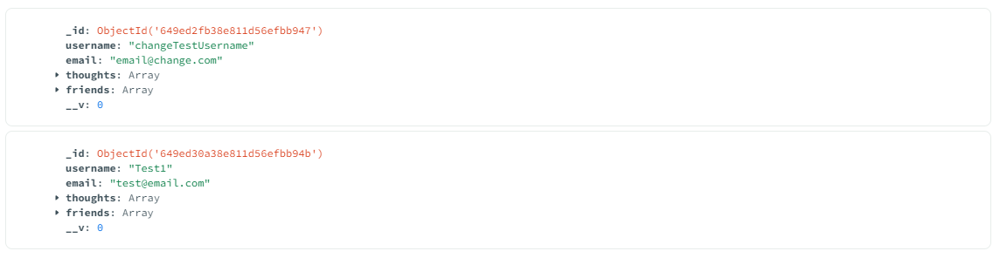

# SocialNetworkAPI

## Description 
This is for the backend of a Social Network API. Allowing you to create a user, create a thought, add a user, react to a users thought and also delete the reaction, thought and user.

Please watch a video demonstration here:  
https://drive.google.com/file/d/11ylDNXSM-CnTogdDdoECpkjI-Fw6nhA6/view

## Screenshots

This is the command line after running mongod / node server.js

This is a snipper of all users in Insomnia

This is a snippet of the MongoDB

## Table of contents
- [Go to Installation](#installation) 
- [Go to Usage](#usage) 
- [Go to Contributing](#contributing) 
- [Go to Tests](#tests)
- [Go to License](#license)
- [Got to Questions](#questions)

## Installation
when in the command line, run npm install.  
then run mongod (assuming you have MongoDB installed on your computer) to start the server  
then run node server.js to start the server.  
then in insomnia, do the required Get/Post/Put/Delete routes.
    
## Usage
The usage for this program is  for the backend of an Social Network API. It is used to:  
Create a user  
Let the user create a thought 
Let the user add another user  
Let the user to react to another users thoughts 
Allow the user to delete their thought, reaction or the other user.

## Contributing
N/A

## Tests
N/A

## License

## Questions

Please checkout my Github account: https://github.com/Joshua-Watson96 

Please e-mail me with any further questions:  joshjkwatson@gmail.com